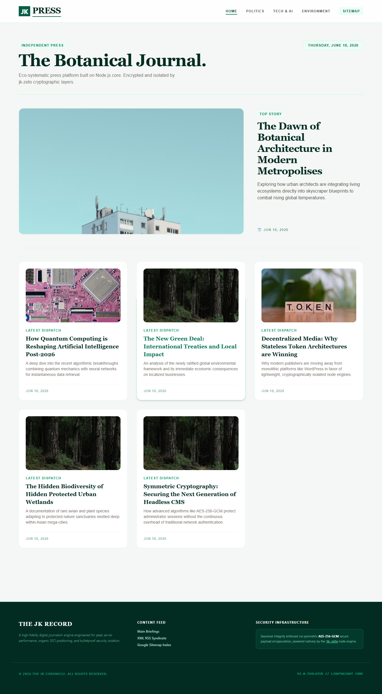

# JkPress - Lightweight & High-Performance Node.js CMS

[English](#english) | [Bahasa Indonesia](#bahasa-indonesia)

---

## English


### 📸 Homepage Preview
<!-- Jalur relatif dari root proyek ke file gambar Anda -->



JkPress is a modern, ultra-lightweight, and lightning-fast Headless Content Management System (CMS) built from scratch using Node.js, Express.js, and SQLite. It is designed to be a highly flexible and fast alternative to WordPress, tailor-made for modern press, blogs, and content platforms. 

JkPress is fully optimized for the modern web era, featuring robust built-in SEO architectures, structured Schema Markup, and AI-friendly configurations that allow AI Search Engines (like Perplexity, ChatGPT, Gemini) to easily index and reference your content.

### Key Features
* ⚡ **Ultra-Fast Performance**: Built on top of raw SQL queries and SQLite without heavy ORM overhead.
* 🔒 **Exclusive Security with `jk-zeto`**: Secured using a custom `SecureToken` encryption module (AES-256-GCM) to completely hide admin session payloads.
* 🛡️ **Production-Ready Security**: Equipped with Brute-Force protection (Rate Limiter) and secure cross-origin communication (CORS).
* 📝 **Session Revocation**: Full token blacklisting system upon administrator logout.
* 🤖 **AI & SEO Friendly**: Built-in dynamic JSON-LD Schema Markup, automated XML Sitemap, and live RSS Feed to make your site a magnet for Google and AI Crawlers.
* 📍 **Geo-Targeting**: Integrated geographical location support (Coordinates and Place Names) for localized news and regional content targeting.
* 🎨 **Themeable Architecture**: Engineered for a modular ecosystem where developers can easily build and switch themes using template engines (EJS).

### Tech Stack
* **Backend Framework**: Node.js & Express.js
* **Database**: SQLite (Zero configuration, file-based database)
* **Authentication**: `jk-zeto` (Custom High-Performance Crypto Token)
* **File Uploads**: Multer
* **SEO Tools**: xmlbuilder2

### Getting Started

#### Prerequisites
Make sure you have Node.js installed on your machine.

#### Installation
1. Clone this repository:
   ```bash
   git clone https://github.com/jknardi/jkpress.git
   cd lightweight-cms
   ```
2. Install dependencies:
   ```bash
   npm install
   ```
3. Create a `.env` file in the root directory and add a 32-character secret key:
   ```env
   PORT=3000
   CMS_SECRET_KEY=your_super_secret_32_char_key_!!
   ```
4. Run the server:
   ```bash
   node app.js
   ```

---

## Bahasa Indonesia

JkPress adalah Content Management System (CMS) Headless yang modern, super ringan, dan kencang, dibangun dari nol menggunakan Node.js, Express.js, dan SQLite. Proyek ini dirancang sebagai alternatif WordPress yang jauh lebih fleksibel dan cepat, dikhususkan untuk kebutuhan pers modern, blog, dan platform konten.

JkPress dioptimalkan sepenuhnya untuk era web mutakhir, menyediakan arsitektur SEO bawaan yang kuat, Data Terstruktur (Schema Markup), serta konfigurasi ramah AI yang memudahkan Mesin Pencari AI (seperti Perplexity, ChatGPT, Gemini) untuk mengindeks dan menjadikan konten Anda sebagai sumber referensi.

### Fitur Utama
* ⚡ **Performa Super Kencang**: Berjalan di atas kueri SQL murni dan SQLite tanpa beban berat dari ORM pihak ketiga.
* 🔒 **Keamanan Eksklusif dengan `jk-zeto`**: Dilindungi menggunakan modul enkripsi token kustom `SecureToken` (AES-256-GCM) sehingga isi data sesi admin tersembunyi penuh dari publik.
* 🛡️ **Proteksi Siap Produksi**: Dilengkapi dengan pencegah serangan Brute-Force (Rate Limiter) dan kebijakan komunikasi lintas domain (CORS) yang aman.
* 📝 **Manajemen Sesi Otomatis**: Sistem penghancuran (*blacklist*) token secara instan ketika admin melakukan Logout.
* 🤖 **Ramah SEO & AI**: Menghasilkan JSON-LD Schema Markup, XML Sitemap otomatis, dan RSS Feed dinamis agar web Anda mudah dirayap oleh Google dan Bot AI.
* 📍 **Target Geografis (Geo-Targeting)**: Integrasi data lokasi (Nama Tempat & Koordinat) untuk kebutuhan jurnalisme lokal atau segmentasi berita daerah.
* 🎨 **Arsitektur Berbasis Tema**: Dirancang agar mendukung ekosistem pembuatan tema (*themes*) yang mudah bagi para developer luar menggunakan template engine (EJS).

### Teknologi yang Digunakan
* **Backend Framework**: Node.js & Express.js
* **Database**: SQLite (Berbasis file tunggal, tanpa ribet konfigurasi server)
* **Autentikasi**: `jk-zeto` (Pustaka Token Kustom Berkinerja Tinggi)
* **Unggah Berkas**: Multer
* **Alat SEO XML**: xmlbuilder2

### Cara Memulai Proyek

#### Persyaratan
Pastikan Anda sudah menginstal Node.js di komputer Anda.

#### Instalasi
1. Klon repositori ini:
   ```bash
   git clone https://github.com/jknardi/jkpress.git
   cd lightweight-cms
   ```
2. Instal library pendukung:
   ```bash
   npm install
   ```
3. Buat file `.env` di folder utama dan masukkan kunci rahasia sepanjang tepat 32 karakter:
   ```env
   PORT=3000
   CMS_SECRET_KEY=rahasia_super_aman_32_karakter_!!
   ```
4. Jalankan server CMS:
   ```bash
   node app.js
   ```

## License
Distributed under the MIT License. See `LICENSE` for more information.
